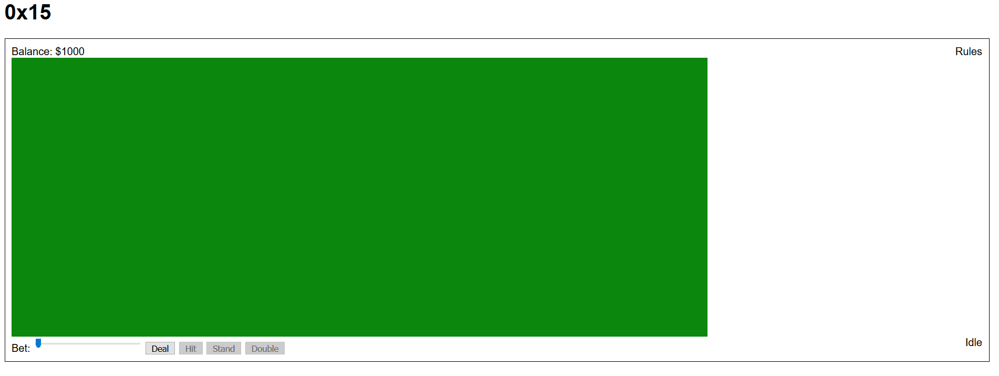
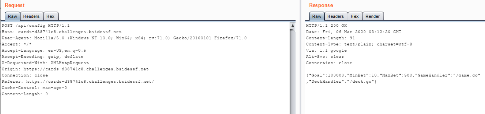
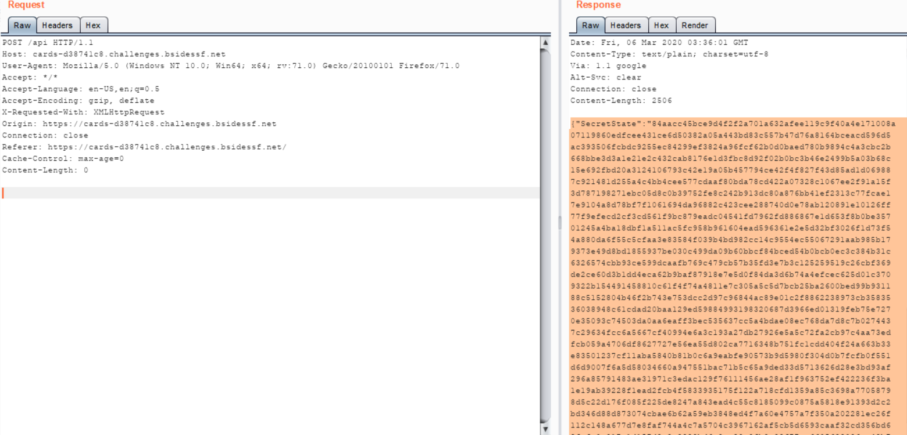
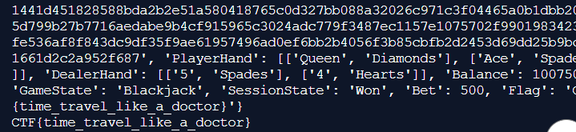

## Write up
- [Link](https://cards-d38741c8.challenges.bsidessf.net/)
  
- Dùng burpsuite để bắt traffic như bình thường, ta thấy request /api/config
  
  Ta có response:
  {"Goal":100000,"MinBet":10,"MaxBet":500,"GameHandler":"/game.go","DeckHandler":"/deck.go"}
  Lúc đầu ta thấy tiền chúng ta có là 1000, như vậy theo response này nếu tiền chúng ta $100000 thì
  sẽ chiến thắng và tìm ra flag.
  Ta gửi request /api
  
  {"SecretState":"84aacc45bce9d4f2f2a701a632afee119c9f40a4e171008a07119860edfcee431ce6d50382a05a443bd83c557b47d76a8164bceacd596d5ac393506fcbdc9255ec84299ef3824a96fcf62b0d0baed780b9894c4a3cbc2b668bbe3d3a1e21e2c432cab8176e1d3fbc8d92f02b0bc3b46e2499b5a03b68c15e692fbd20a3124106793c42e19a05b457794ce42f4f827f43d85ad1d069887c921481d255a4c4bb4cee577cdaaf80bda78cd422a07328c1067ee2f91a15f3d787198271ebc05d8c0b39752fe8c242b913dc80a876bb41ef2313c77fcae17e9104a8d78bf7f1061694da96882c423cee288740d0e78ab120891e10126ff77f9efecd2cf3cd561f9bc879eadc04541fd7962fd886867e1d653f8b0be35701245a4ba18dbf1a511ac5fc958b961604ead596361e2e5d32bf3026f1d73f54a880da6f55c5cfaa3e83584f039b4bd982cc14c9554ec55067291aab985b179373e49d8bd1855937be030c499da09b60bbcf84bced54b0bcb0ec3c384b31c6326574cbb93ce599dcaafb769c479cb57b35fd3e7b3c125259519c26cbf369de2ce60d3b1dd4eca62b9baf87918e7e5d0f84da3d6b74a4efcec625d01c3709322b154491458810c61f4f74a4811e7c305a5c5d7bcb25ba2600bed99b931188c5152804b46f2b743e753dcc2d97c96844ac89e01c2f8862238973cb3583536038948c61cdad20baa129ed59884993198320687d3966ed01319feb75e7270e35093c74503da0aa6eaff3bec535637cc5a4bdae08ec768da7d8c7b0274437c29634fcc6a5667cf40994e6a3c193a27db27926e5a5c72fa2cb97c4aa73edfcb059a4706df8627727e56ea55d802ca7716348b751fc1cdd404f24a663b33e83501237cf11aba5840b81b0c6a9eabfe90573b9d5980f304d0b7fcfb0f551d6d9007f6a5d58034660a947551bac71b5c65a9ded33d5713626d28e3bd93af296a85791483ae31971c3edac129f76111456ae28af1f963752ef422236f3ba1e19ab39228f1ead2fcb4f5833935175f122a718cfd1359a85c3698a77058798d5c22d176f085f225de8247a843ead4c55c8185099c0875a5818e91393d2c2bd346d88d873074cbae6b62a59eb3848ed4f7a60e4757a7f350a202281ec26f112c148a677d7e8faf744a4c7a5704c3967162af5cb5d6593caaf32cd356bd62fafe0c917e1d157d2a2e2823bd6e9ca29e9fb3a98f77ac6605629036ac49b762e02e2d4bd8c926f56bb6ede092dcd1b979cbf690b6aad29f9b89f7f818453bf49bfcf02351385df550012aeacaf5d50886e33ccad26c57a0f0b40666b60fe5f1f98477929d8bfeab18f6d0f2f9179cb0f60ea5c56206fe6bac83ea69180654da8bf9bbb409c3c8ab9a68b1b8d2ab7e213e12b24ea11cef8cc3f21c2fed495693f612612c70829efc960926edeb7ca44b9ce16c99b09db67dcebf5a9360625a040310d5ee8af21bdda5002426b63fdc674646de36fe05afc5d75c713c929270cf45cede0f1737d11e4ffafb880aba0d864fbba847e696d3e402a64c0be3a9c13f042f1abd5d0a95b722be2a83dad10e55b1593961156c2657d4ddbc2d95fec388a12f147d48f407f1b5b1c397791748e1a80aff46cafdec5d5e6a779bfed8affe3c4a426f37277e2c1aae1a6c65e79940c473bca55df3fb8801c7cb926a6f1","PlayerHand":[],"DealerHand":[],"Balance":1000,"GameState":"Idle","SessionState":"Playing","Bet":0}
  
- Khi bạn gửi request tới /api/deal thì giá trị SecretState không thay đổi, và các lá bài của người chơi và quản lí được tạo ngẫu nhiên, đến
  khi trò chơi kết thúc thì số dư tăng lên ngay lập tức.
- Vấn đề là khi bạn thua hay thắng thì giá trị SecretState không thay đổi và số dư vẫn tăng lên, vậy ta cần làm là gửi request và lấy kết quả 
  trả về khi trong res có 'Flag'.
- Ta có đoạn script như trong file test.py (python 3)
- Cuối cùng ta được flag : CTF{time_travel_like_a_doctor}
  