## Writeup
- [Link](https://hurdles-0afa81d6.challenges.bsidessf.net/)
  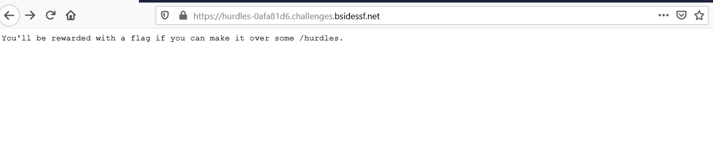
- Bài này về kiến thức HTTP
  Đầu tiên, You'll be rewarded with a flag if you can make it over some /hurdles.
  Bảo mình vào url ../hurdles , vào rồi thì nó hiện ra thông báo
  I'm sorry, I was expecting the PUT Method.
  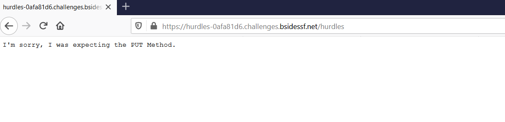

- Ok, sửa thành PUT request
  Tiếp tục: I'm sorry, Your path would be more exciting if it ended in !
  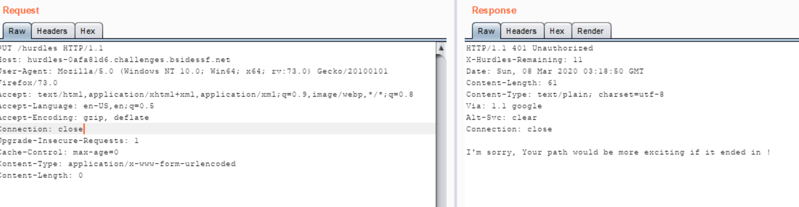

- Thêm ! vào cuối => url: /hurdles/! với PUT request
  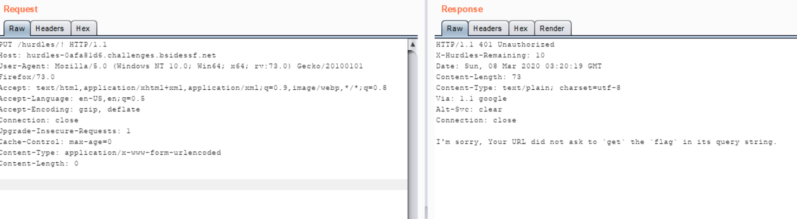
  
  I'm sorry, Your URL did not ask to `get` the `flag` in its query string.

- Làm theo yêu cầu của nó sửa url thành /hurdles/!?get=flag
  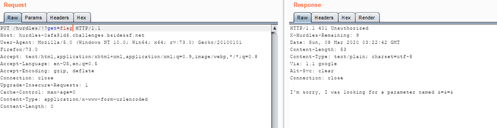

  I'm sorry, I was looking for a parameter named &=&=&

- Encode url &=&=& = %26%3D%26%3D%26 và gửi request đến url: /hurdles/!?get=flag&%26%3D%26%3D%26=a
  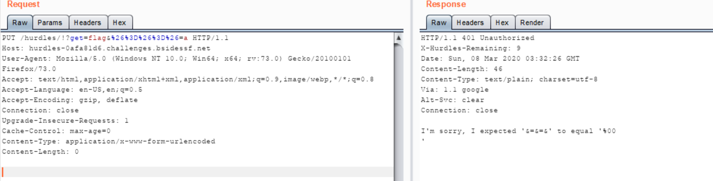

  I'm sorry, I expected '&=&=&' to equal '%00

- gán &=&=& bằng %00 encode 
  /hurdles/!?get=flag&%26%3D%26%3D%26=%2500%0a
  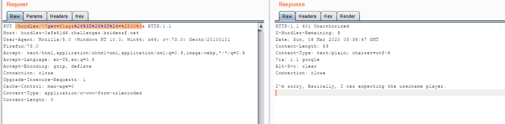

  I'm sorry, Basically, I was expecting the username player.

- Từ giờ mình sẽ dùng tool curl để giải bài: 
  ta dùng lệnh: curl -X PUT --basic --user "player:test" --data-raw "%26%3D%26%3D%26=%2500%0a" -v "https://hurdles-0afa81d6.challenges.bsidessf.net/hurdles/!?get=flag"
  Và nó ra: I'm sorry, Basically, I was expecting the password of the hex representation of the md5 of the string 'open sesame'
  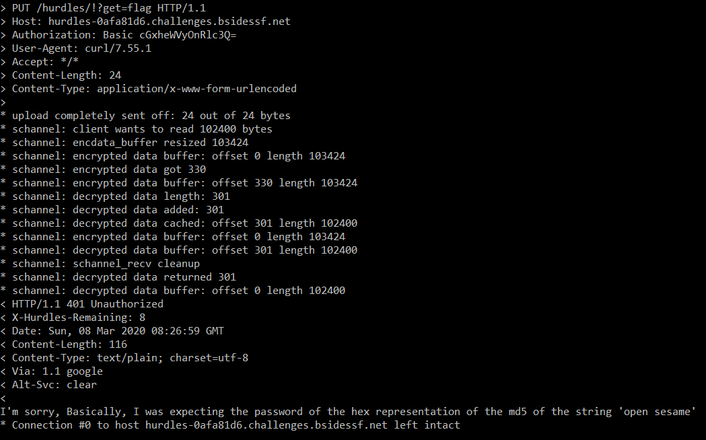

- Encode 'open sesame' bằng md5 hash rồi chạy dòng lệnh này
  curl -X PUT --basic --user "player:54ef36ec71201fdf9d1423fd26f97f6b" --data-raw "%26%3D%26%3D%26=%2500%0a" -v "https://hurdles-0afa81d6.challenges.bsidessf.net/hurdles/!?get=flag"
  và kết quả:
  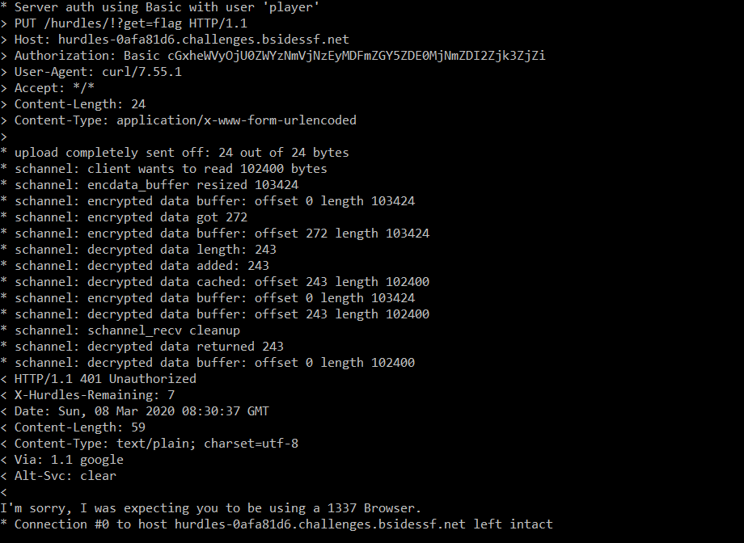

  I'm sorry, I was expecting you to be using a 1337 Browser.

- Nó bắt mình dùng 1337 Browser
  curl -X PUT --basic --user "player:54ef36ec71201fdf9d1423fd26f97f6b" --user-agent "1337" --data-raw "%26%3D%26%3D%26=%2500%0a" -v "https://hurdles-0afa81d6.challenges.bsidessf.net/hurdles/!?get=flag"
  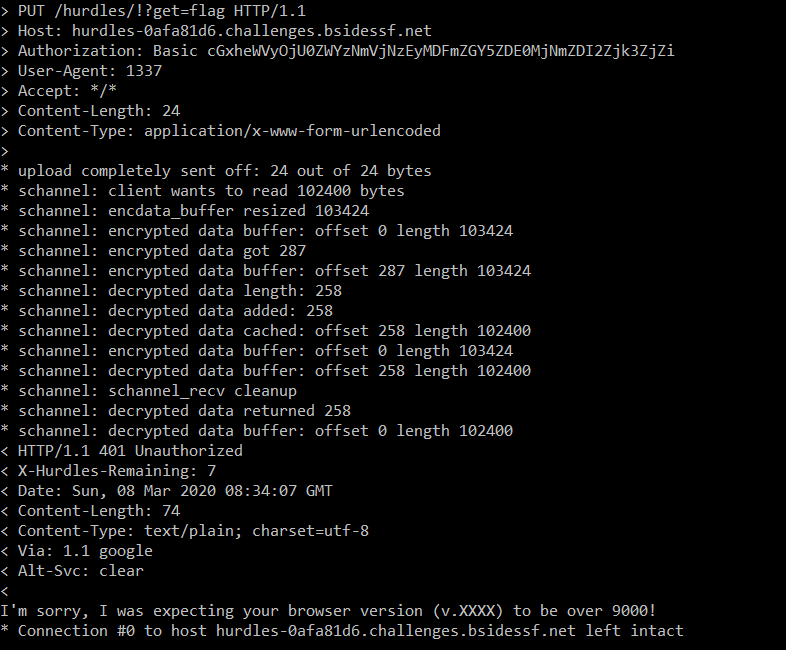

  I'm sorry, I was expecting your browser version (v.XXXX) to be over 9000!

- Bắt mình dùng version lớn hơn 9000
  curl -X PUT --basic --user "player:54ef36ec71201fdf9d1423fd26f97f6b" --user-agent "1337 v.9001" --data-raw "%26%3D%26%3D%26=%2500%0a" -v "https://hurdles-0afa81d6.challenges.bsidessf.net/hurdles/!?get=flag"
  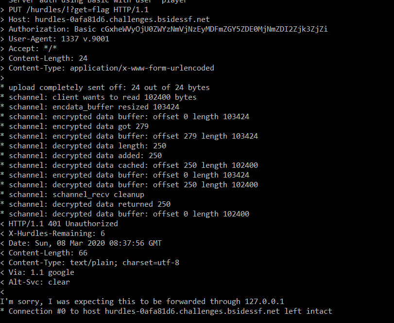

  I'm sorry, I was expecting this to be forwarded through 127.0.0.1

- Dùng 
  curl -X PUT --basic --user "player:54ef36ec71201fdf9d1423fd26f97f6b" --user-agent "1337 v.9001" -H "X-Forwarded-For: 127.0.0.1,127.0.0.1" --data-raw "%26%3D%26%3D%26=%2500%0a" -v "https://hurdles-0afa81d6.challenges.bsidessf.net/hurdles/!?get=flag"
  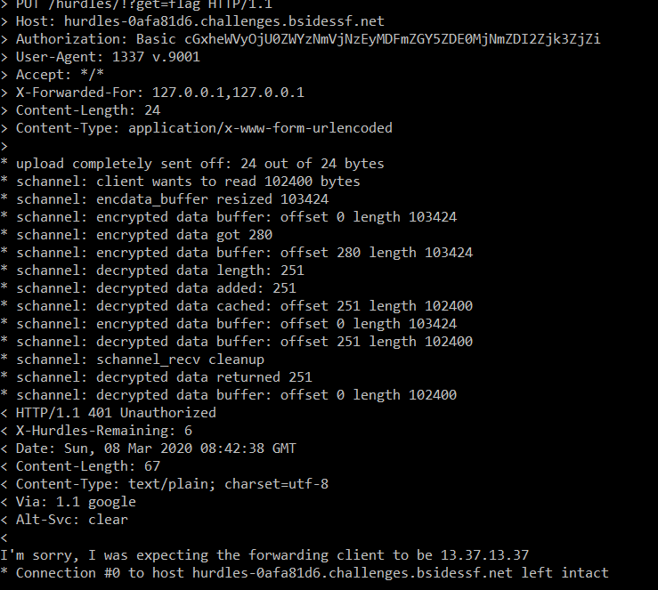

  I'm sorry, I was expecting the forwarding client to be 13.37.13.37

- Chạy câu lệnh
  curl -X PUT --basic --user "player:54ef36ec71201fdf9d1423fd26f97f6b" --user-agent "1337 v.9001" -H "X-Forwarded-For: 13.37.13.37,127.0.0.1" --data-raw "%26%3D%26%3D%26=%2500%0a" -v "https://hurdles-0afa81d6.challenges.bsidessf.net/hurdles/!?get=flag"
  

  I'm sorry, I was expecting a Fortune Cookie

- Chạy 
  curl -X PUT --basic --user "player:54ef36ec71201fdf9d1423fd26f97f6b" --user-agent "1337 v.9001" -H "X-Forwarded-For: 13.37.13.37,127.0.0.1" --data-raw "%26%3D%26%3D%26=%2500%0a" -H "Cookie: Fortune" -v "https://hurdles-0afa81d6.challenges.bsidessf.net/hurdles/!?get=flag"
  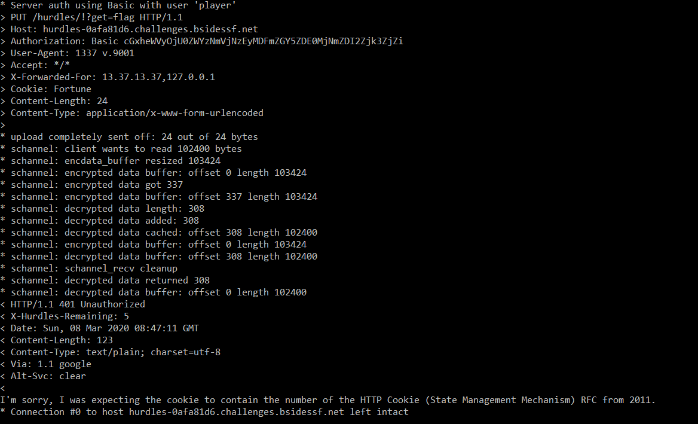

  I'm sorry, I was expecting the cookie to contain the number of the HTTP Cookie (State Management Mechanism) RFC from 2011.

- Search google "cookie to contain the number of the HTTP Cookie (State Management Mechanism) RFC from 2011." ra RFC 6265
  curl -X PUT --basic --user "player:54ef36ec71201fdf9d1423fd26f97f6b" --user-agent "1337 v.9001" -H "X-Forwarded-For: 13.37.13.37,127.0.0.1" --data-raw "%26%3D%26%3D%26=%2500%0a" -H "Cookie: Fortune=RFC6265" -v "https://hurdles-0afa81d6.challenges.bsidessf.net/hurdles/!?get=flag"
  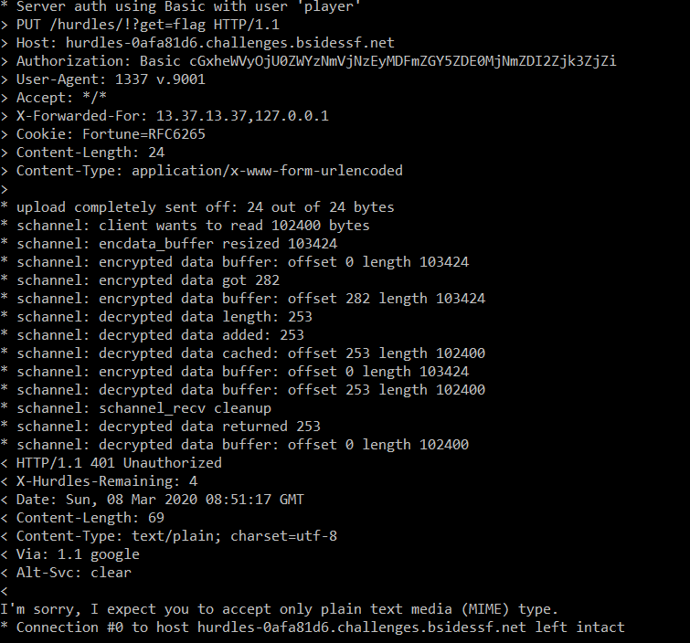

  I'm sorry, I expect you to accept only plain text media (MIME) type.

- Chạy:
  curl -X PUT --basic --user "player:54ef36ec71201fdf9d1423fd26f97f6b" --user-agent "1337 v.9001" -H "X-Forwarded-For: 13.37.13.37,127.0.0.1" --data-raw "%26%3D%26%3D%26=%2500%0a" -H "Cookie: Fortune=RFC6265" -H "Accept: text/plain" -v "https://hurdles-0afa81d6.challenges.bsidessf.net/hurdles/!?get=flag"
  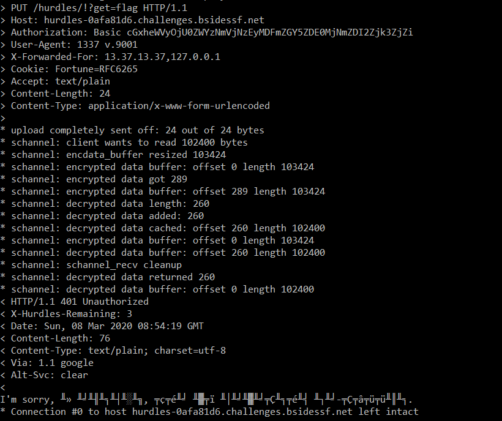

  I'm sorry, Я ожидал, что вы говорите по-русски.

- Nó ra ngôn ngữ gì đó, setup ngôn ngữ lại rất đọc được dòng text
  curl -X PUT --basic --user "player:54ef36ec71201fdf9d1423fd26f97f6b" --user-agent "1337 v.9001" -H "X-Forwarded-For: 13.37.13.37,127.0.0.1" --data-raw "%26%3D%26%3D%26=%2500%0a" -H "Cookie: Fortune=RFC6265" -H "Accept: text/plain" -H "Accept-Language: ru" -v "https://hurdles-0afa81d6.challenges.bsidessf.net/hurdles/!?get=flag"
  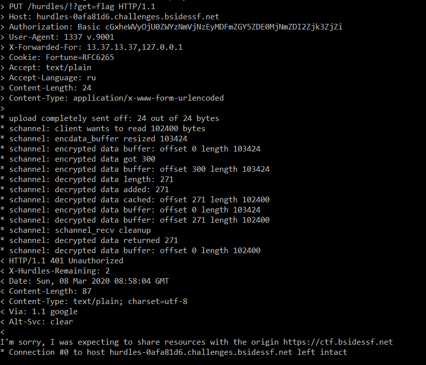

  I'm sorry, I was expecting to share resources with the origin https://ctf.bsidessf.net

- Chạy: 
  curl -X PUT --basic --user "player:54ef36ec71201fdf9d1423fd26f97f6b" --user-agent "1337 v.9001" -H "X-Forwarded-For: 13.37.13.37,127.0.0.1" --data-raw "%26%3D%26%3D%26=%2500%0a" -H "Cookie: Fortune=RFC6265" -H "Accept: text/plain" -H "Accept-Language: ru" -v -H "Origin: https://ctf.bsidessf.net" "https://hurdles-0afa81d6.challenges.bsidessf.net/hurdles/!?get=flag"
  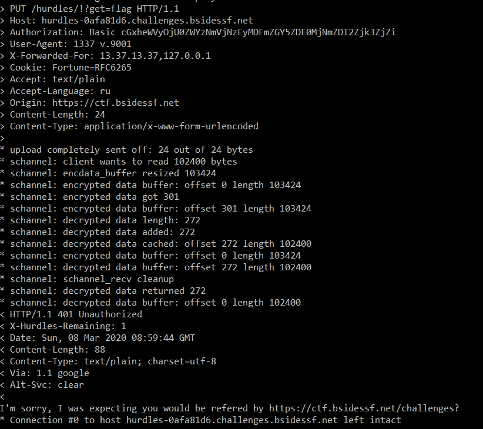

  I'm sorry, I was expecting you would be refered by https://ctf.bsidessf.net/challenges?

- Chạy:
  curl -X PUT --basic --user "player:54ef36ec71201fdf9d1423fd26f97f6b" --user-agent "1337 v.9001" -H "X-Forwarded-For: 13.37.13.37,127.0.0.1" --data-raw "%26%3D%26%3D%26=%2500%0a" -H "Cookie: Fortune=RFC6265" -H "Accept: text/plain" -H "Accept-Language: ru" -v -H "Origin: https://ctf.bsidessf.net" -H "Referer: https://ctf.bsidessf.net/challenges" "https://hurdles-0afa81d6.challenges.bsidessf.net/hurdles/!?get=flag"
  
  Haizz ! Đến cuối cùng cũng ra flag: 
  