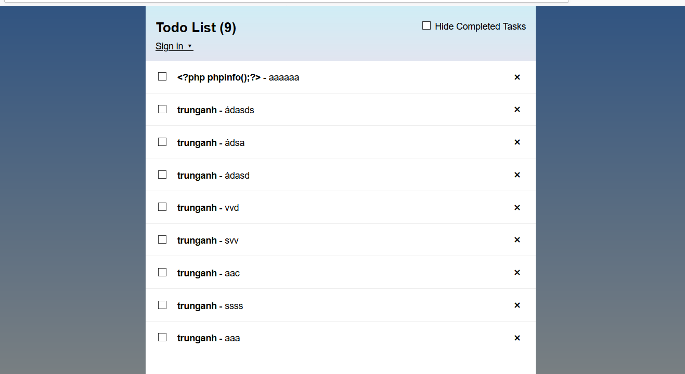
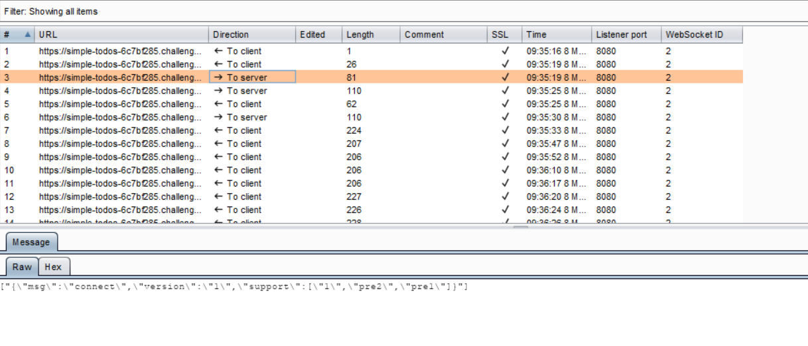
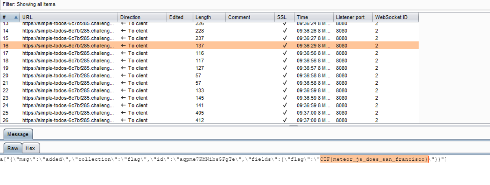

## Writeup
- [Link](https://simple-todos-6c7bf285.challenges.bsidessf.net/)
  For my new job as a San Franisco tour guide, I totally realized that I can use the Meteor simple-todos tutorial! It was really easy, the app works perfectly by step 9 of the tutorial, you don't even need to write your own 'publish and subscribe' code! It's all done for you!
  
- Phần này mình không rành lắm, nhưng hình như dùng web socket , mình dùng burpsuite bắt traffic thì thấy ra mấy cái dữ liệu qua lại giữa 
  client và server
  
  Và mình cứ bắt như vậy đến khi thấy flag
  